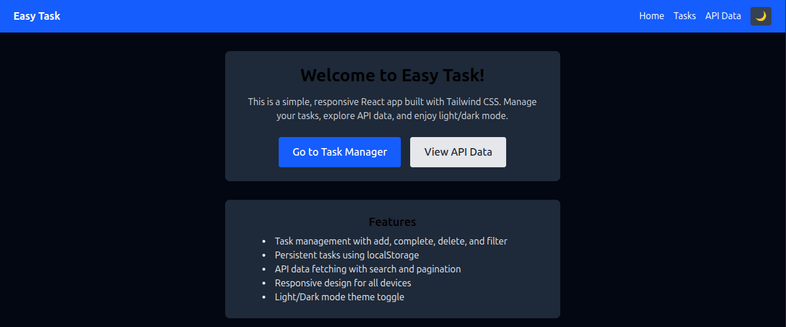
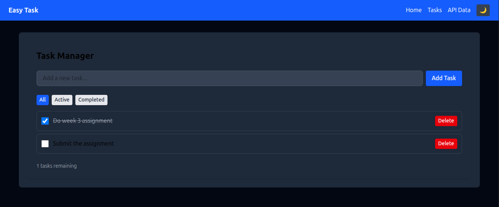
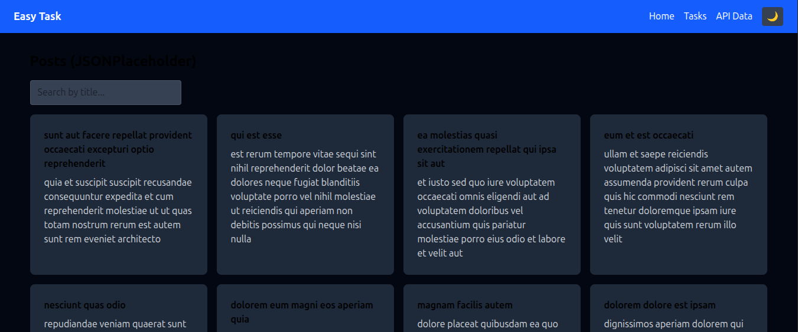

[](https://classroom.github.com/online_ide?assignment_repo_id=19861078&assignment_repo_type=AssignmentRepo)
# Easy Task – React & Tailwind Assignment

A responsive React application demonstrating component architecture, state management, custom hooks, API integration, and Tailwind CSS theming.

---

## 🚀 Features

- **Task Manager:** Add, complete, delete, and filter tasks (All, Active, Completed)
- **Persistent Storage:** Tasks saved in localStorage via a custom hook
- **API Integration:** Fetch and search posts from JSONPlaceholder with pagination
- **Responsive Design:** Works on mobile, tablet, and desktop
- **Theme Switcher:** Light/Dark mode using Tailwind’s dark mode
- **Reusable Components:** Button, Card, Navbar, Footer, Layout

---

## 🖼️ Screenshots

### Home Page


### Task Manager


### API Data Page


---

## 🛠️ Setup Instructions

1. **Clone the repository**
   ```bash
   git clone https://github.com/your-username/week-3-react-js-assignment-Sir-JamesMuritu.git
   cd week-3-react-js-assignment-Sir-JamesMuritu
   ```

2. **Install dependencies**
   ```bash
   pnpm install
   # or
   npm install
   ```

3. **Start the development server**
   ```bash
   pnpm run dev
   # or
   npm run dev
   ```

4. **Open in your browser**
   ```
   http://localhost:5173/
   ```

---

## 🌐 Deployed Application

[Live Demo](https://week-3-react-js-assignment-sir-jame.vercel.app)

---

## 📁 Project Structure

```
src/
├── components/       # Reusable UI components
├── pages/            # Page components
├── hooks/            # Custom React hooks
├── context/          # React context providers
├── api/              # API integration functions
├── utils/            # Utility functions
└── App.jsx           # Main application component
```

---

## 📚 Technologies Used

- React
- Tailwind CSS
- React Router
- Vite
- JSONPlaceholder API

---

## 👤 Author

- [Sir-JamesMuritu](https://github.com/PLP-MERN-Stack-Development/week-3-react-js-assignment-Sir-JamesMuritu)

---

> _Replace screenshot paths and deployment URL with
